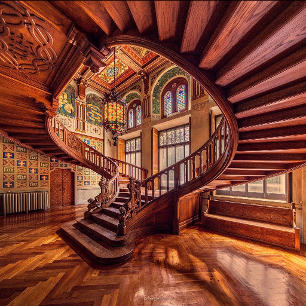
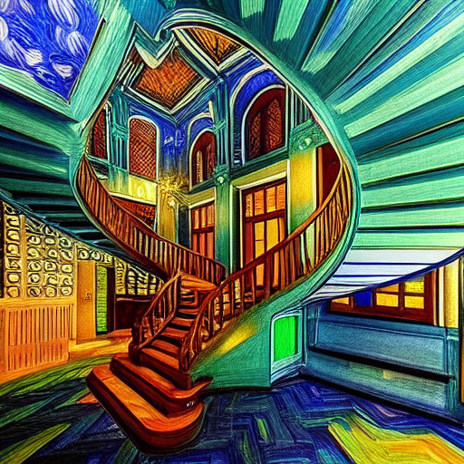
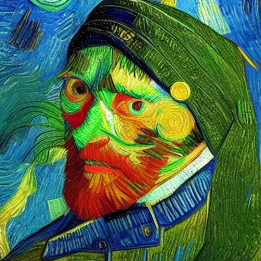
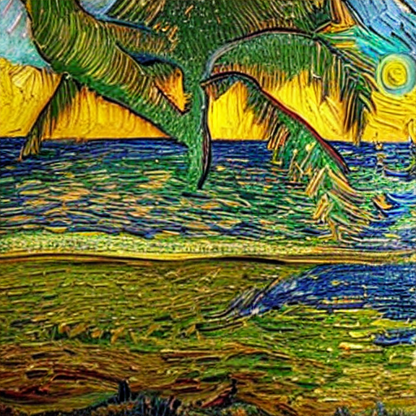
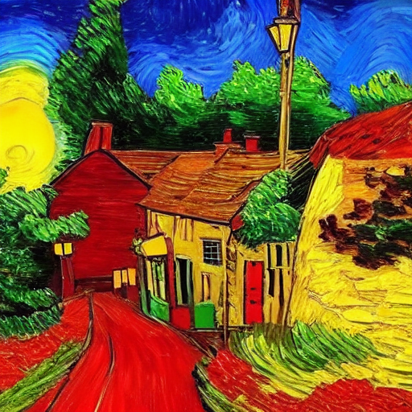

# ComfyUI Van Gogh Style Transfer

This project demonstrates a Van Gogh style transfer using ComfyUI. The repository includes a complete workflow file, Python scripts for preprocessing and style transfer, and sample outputs.

## Examples

Below are some sample images showing the before and after Van Gogh style transformation:


| Before | After |
|--------|-------|
|  |  |


| Before | After |
|--------|-------|
|  |  |


| Before | After |
|--------|-------|
|  |  |


| Before | After |
|--------|-------|
|  |  |


| Before | After |
|--------|-------|
|  |  |

## Setup Process

### Prerequisites

- Python 3.8 or higher
- ComfyUI installed


1. Download models and files from the following links:
    - [Stable Diffusion v15-pruned-emaonly-fp16 safetensors](https://huggingface.co/Comfy-Org/stable-diffusion-v1-5-archive/resolve/main/v1-5-pruned-emaonly-fp16.safetensors?download=true) (necessary)
    - [ControlNet Canny fp16 safetensors](https://huggingface.co/webui/ControlNet-modules-safetensors/resolve/main/control_canny-fp16.safetensors?download=true) (necessary)
    - [ControlNet Lineart fp16 safetensors](https://huggingface.co/lllyasviel/control_v11p_sd15_lineart/resolve/main/diffusion_pytorch_model.fp16.safetensors?download=true) (optional for control net chaining workflow)

1. Copy the contents inside "my_custom_nodes" to "comfyUI\custom_nodes" folder.

2. Navigate to "custom_nodes" folder inside comfyUI and install the required Python packages.
    ```bash
    pip install -r requirements.txt
    ```

3. Import the workflow file into ComfyUI:
    - Open ComfyUI.
    - Navigate to the workflow import section.
    ### Important Note
    - There are two versions of the workflow. Highly detailed style transfer nodes can sometimes generate noisy images. To avoid this, two different workflows are provided.
    *_v1 versions are more stable and generate better results. But they have less control over style transfer.
    *_v2 versions have more control over style transfering. But depending on the input parameters, tensors could deviate from the control net output distribution. This could result in noisy images. To avoid this, you can use the *_v1 versions of the workflows.
    ###

    1. If you want to generate images faster and slightly less quality Import the `canny_diffusion_finetuned.json` file located in the workflows folder of this repository. It uses only one control net to get results faster.

    2. If you want to generate better images Import the `control_net_chaining_v2.json` file located in the workflows folder of this repository. It chains two differenct control nets to get better results.
     

## Usage Instructions

1. Open the workflow in ComfyUI.

2. Upload the image you want to apply the Van Gogh style to.

3. Run the workflow.

4. The output image will be displayed in the output node.

## Additional Notes

- Detailed information about custom nodes can be found in the `my_custom_nodes` folder.

- Decided not to use 3d party nodes and libraries for style transfer. Goal is to reduce the complexity and overhead of the workflow as much as possible.

- Decided not to use LoRA and Van-Gogh fine-tuned models. By doing this, I aimed to be more scalable to various style transfer tasks.

- Observed that default stable diffusion with simple canny control net can achieve decent results. So I decided to use this combination.

- Parameters are adjusted to be fast and efficient.

- Models are pruned and quantized in order to be fast and efficient.

- KSampler parameters are adjusted to be fast and decent quality. (https://stable-diffusion-art.com/samplers/)

- Links to the models are provided below:

    https://huggingface.co/Comfy-Org/stable-diffusion-v1-5-archive/tree/main

    https://huggingface.co/webui/ControlNet-modules-safetensors/tree/main

    https://huggingface.co/lllyasviel/control_v11p_sd15_lineart/tree/main
